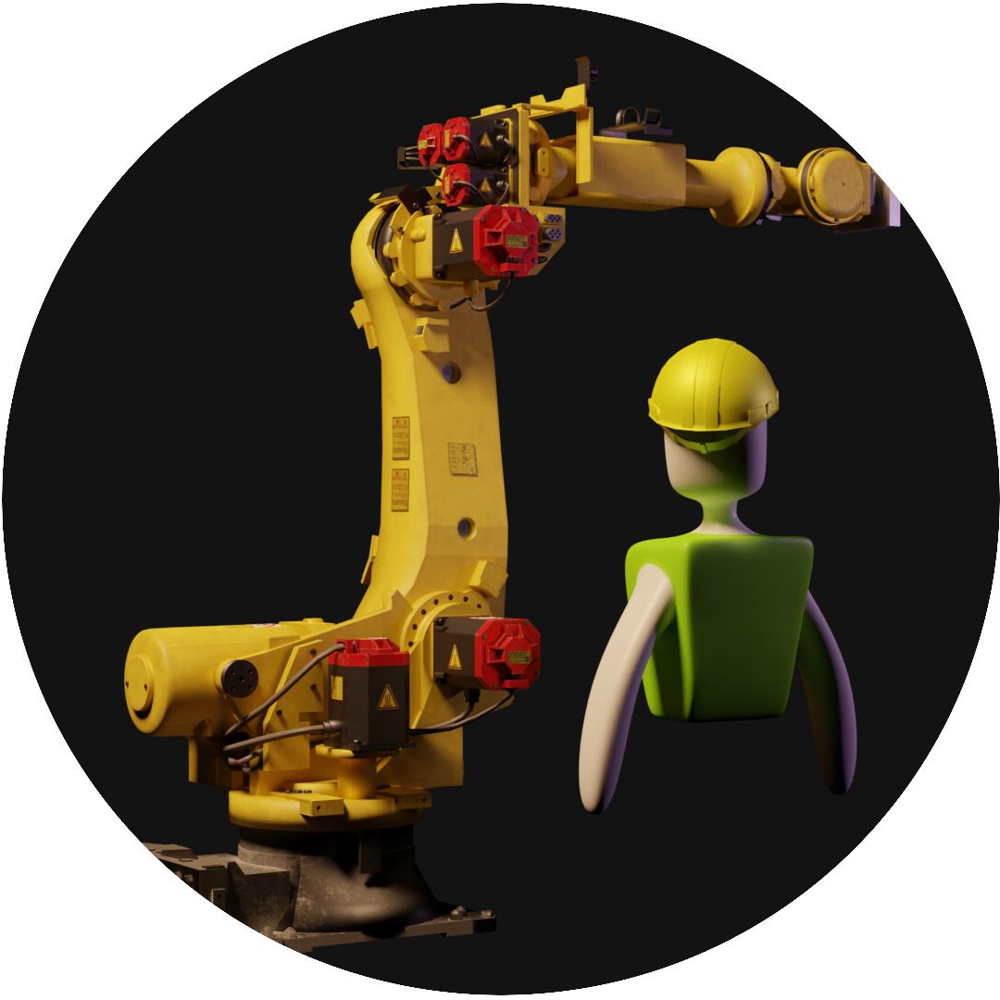

# NSF-EPSCoR-RA-Robot-Training
Unity Project for the NSF EPSCoR RA – Robot
<p align="center">
  <a href="" rel="noopener">
 </a>
</p>

<h3 align="center">Robot Training</h3>

<div align="center">

  []() 
  [](https://github.com/WKUXRLab/NSF-EPSCoR-RA-Robot-Training/issues)
  [](https://github.com/WKUXRLab/NSF-EPSCoR-RA-Robot-Training/pulls)
  [](/LICENSE)

</div>

---

<p align="center"> Few lines describing your project.
    <br> 
</p>

## 📝 Table of Contents
- [About](#about)
- [Getting Started](#getting_started)
- [Deployment](#deployment)
- [Usage](#usage)
- [Built Using](#built_using)
- [Authors](#authors)
- [Acknowledgments](#acknowledgement)

## 🧐 About <a name = "about"></a>
Unity Project that simulates the functionalities of the FANUC 2000iC robot contains 2 main scripts inside the "InteractiveRobot/RobotIKOptimized" folder
Compared to the previous versions. The logic for the movement of the robot uses an in-house solution for the IK manager and the scripts can be instanciated several times.
The Robot can be move through FK or IK directions but all the joints have a rotation limit.
## 🏁 Getting Started <a name = "getting_started"></a>
These instructions will get you a copy of the project up and running on your local machine for development and testing purposes. See [deployment](#deployment) for notes on how to deploy the project on a live system.

### Prerequisites

- PC capable of running Unity
- Oculus VR Headset with hand tracking support
- Link cable or usb-c cable
- Unity 2021.1.14f with android extension

### Installing
#### A step by step series of examples that tell you how to get a development env running:

1. Download the repository using the following url

```
https://github.com/WKUXRLab/NSF-EPSCoR-RA-Robot-Training.git
```
Alternatively you can download the entire repository as a zip file

2. Open Unity Hub and add a the downloaded project.

A new project will show up on the list and you will be able to open it.

3. Once the compilation is done, go to project settings and enable XR deployment for android

End with an example of getting some data out of the system or using it for a little demo.

## 🔧 Known Issues <a name = "tests"></a>
Explain how to run the automated tests for this system.

### Break down into end to end tests
Explain what these tests test and why

```
Give an example
```

### And coding style tests
Explain what these tests test and why

```
Give an example
```

## 🎈 Usage <a name="usage"></a>
This is an alpha version of the project to train engineering student on how to use an industrial robot

## 🚀 Deployment <a name = "deployment"></a>
### To run the project on the standalone headset do the following:

1. Set the Build Settings of the project to android
2. Make sure that you allow your headset to connect to your pc.
3. Click on Build and Deploy
4. Wait until the process is complete and try to not move the cable
5. Done !


Alternatively, you can select the build option and upload the APK to your headset using SideQuest

## ⛏️ Built Using <a name = "built_using"></a>
- [Unity](https://unity.com/) - Game Engine
- [Oculus SDK](https://developer.oculus.com/) - Oculus Development Kit
- [MRTK](https://github.com/microsoft/MixedRealityToolkit-Unity) - Microsoft Developer Tool

## ✍️ Authors <a name = "authors"></a>
- [@Klaimtrev](https://github.com/Klaimtrev) - Diego Minaya - Robot System and 3D Modelling
- [@sterry733](https://github.com/sterry733) - Sarah Terry - Script and Level Design
- [@QuisDiMoo](https://github.com/QuisDiMoo) - Chris DiMeo - VR adaptation and MR testing
- [@madison-whittle](https://github.com/madison-whittle) - Madison Whittle - Documentation and Social Media Manager
- [@Kitriguin](https://github.com/Kitriguin) - Kristina Riney - User Interface, MRTK and Oculus SDK Set Up
- [@EmilyYeager14](https://github.com/EmilyYeager14) - Emily Yeager - 3D scanning
- Isabel Ocegueda - Coding adaptation for Robot V1
- Zachary Mers - 3D printing  


## 🎉 Acknowledgements <a name = "acknowledgement"></a>
- References
Our IK implementation for the robot was made following the guide from Alan Zucconi (https://www.alanzucconi.com/2017/04/10/robotic-arms/)
